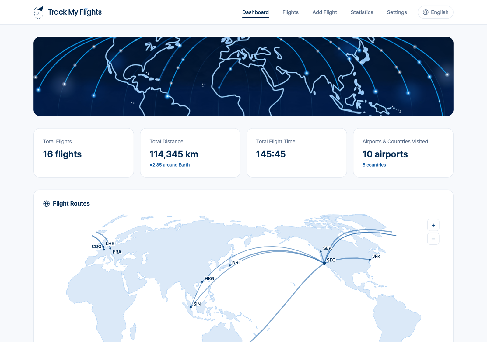
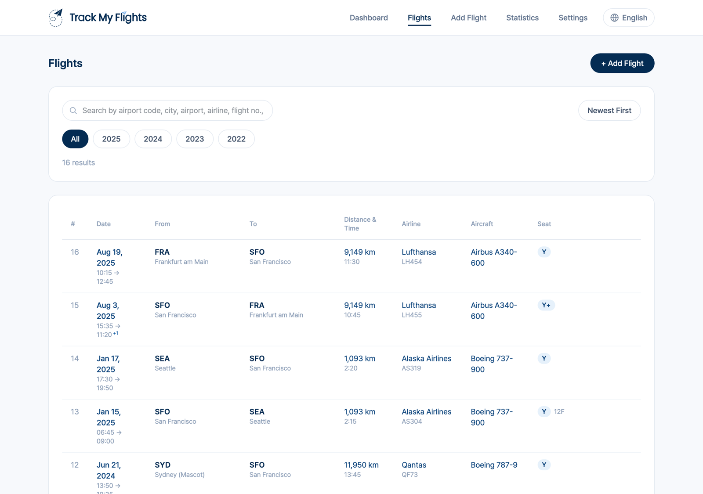
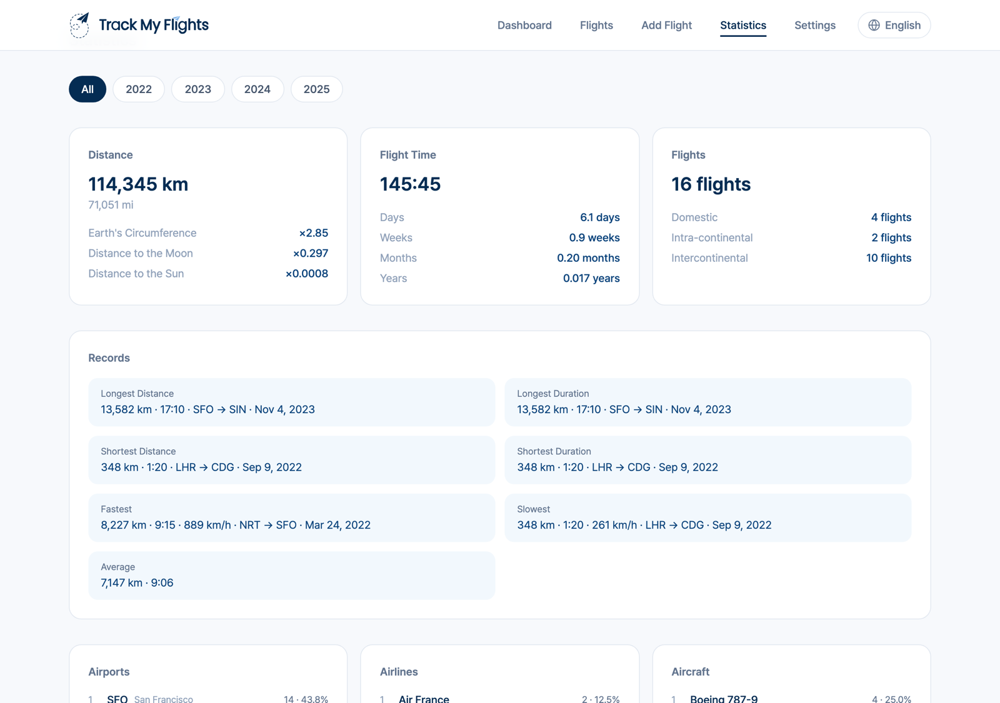
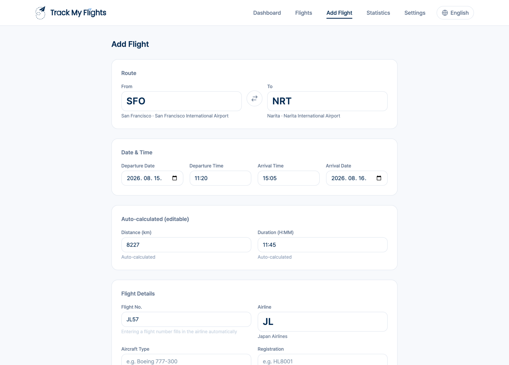

# Track My Flights

**English** · [한국어](docs/README_ko.md)

I used a web-based solution to track my flight logs, which is hosted by someone who is running it voluntarily.<br>
It worked well, but I always had some concerns that it might be discontinued all of a sudden.<br>
So I made it on my own. I let Claude Code build it from my sketch and rough ideas.<br>
You control all your flight logs with this code. NO ACCOUNT, NO CLOUD, NO TRACKING; the app runs fully OFFLINE.



A **local, self-hosted flight logbook**. Log every flight you take, browse them on a world map, and get the full stats treatment — total distance in laps around Earth, top routes, longest/fastest legs, class and seat breakdowns. Your data lives in a single SQLite file on your machine.

## Features

- **Log flights fast** — airport/airline autocomplete (searchable by code, city, or name), flight-number → airline auto-fill, automatic great-circle distance and timezone/DST-aware duration.
- **Dashboard & world map** — route arcs on an offline vector map with zoom/pan, upcoming flights, recent flights.
- **Statistics** — totals, records, top-10 routes/airports/airlines/aircraft, per-year table, class/seat/role distributions.
- **Your data, portable** — one-click JSON/CSV export, JSON import, and the DB is just a file you can copy.
- **English & Korean UI**, km/mi and 12/24-hour display preferences (browser-locale defaults). Adding a language is one JSON file.

### A look around

**Flights** — searchable, filterable by year, with the day-offset marks that long-haul logging actually needs.



**Statistics** — totals, records, and top-10 breakdowns, per year or all-time.



**Add flight** — type two airport codes and a flight number; distance, duration and the airline fill themselves in.



*(Screenshots use sample data.)*

## Requirements

- Node.js 20+ and npm
- macOS, Linux, or Windows (better-sqlite3 builds natively; macOS needs Xcode Command Line Tools)

## Quick start

```bash
npm install
npm run seed     # load the bundled airport + airline reference data into SQLite
npm run build
npm start        # → http://localhost:7470
```

For development: `npm run dev` (Vite on :5173, API proxied to :7470).

The server binds to `127.0.0.1` only. Port: `MFM_PORT=8080 npm start`. DB path: `MFM_DB_PATH=/path/flights.db`.

## Bringing your existing flight log

If you have flight history in another system, export it, shape it into the JSON format described in [docs/MIGRATION.md](docs/MIGRATION.md), and load it:

```bash
npm run import:json -- my-flights.json
```

Optionally, record the statistics your old system showed (total distance, top routes, …) into `migration/anchors.json` (start from `migration/anchors.example.json`) and run `npm run verify` — it cross-checks the imported database against those numbers so you *know* nothing was lost in translation. That verification loop is the heart of this project: the numbers must survive the move.

## Backup & restore

The entire log is `data/flights.db`. Copy that file anywhere (it uses WAL mode — stop the server first, or use `sqlite3 data/flights.db ".backup 'backup.db'"` while running). Restoring = putting the file back. JSON export/import round-trips losslessly too (`Settings → Export`, then `npm run import:json`).

## Keeping it running (macOS example)

`examples/launchd.plist.example` is a LaunchAgent template (auto-start on boot, restart on crash). Fill in the placeholder paths, then:

```bash
cp examples/launchd.plist.example ~/Library/LaunchAgents/com.yourname.trackmyflights.plist
launchctl bootstrap gui/$(id -u) ~/Library/LaunchAgents/com.yourname.trackmyflights.plist
```

On Linux, a systemd user unit running `npm start` works the same way.

## Reference data

Airports come from [OurAirports](https://ourairports.com/data/) and airlines from [OpenFlights](https://openflights.org/data.html), snapshotted in `data/reference/`. To refresh them, replace those files and re-run `npm run seed` (your own airline-name spellings in logged flights take precedence over the reference names). See [NOTICE.md](NOTICE.md) for data licenses.

## Development

```bash
npm test            # unit tests (distance, duration/DST, flight-number normalization)
npm run i18n:check  # fails if any UI string bypasses the i18n catalogs
npx tsc --noEmit
```

UI strings live in `web/src/i18n/{ko,en}.json` (flat keys; the two files are key-checked against each other at compile time). To add a language: copy `en.json` to your locale, translate, register it in `web/src/i18n/index.tsx`.

Honest scoping note: the import/verify pipeline has been battle-tested against exactly one person's 108-flight history. Edge cases from other data shapes are expected — issues and PRs welcome.

## License

[MIT](LICENSE). Reference data and bundled font have their own licenses — see [NOTICE.md](NOTICE.md).
